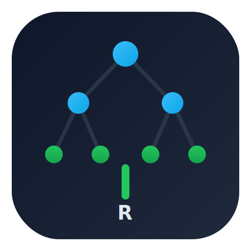
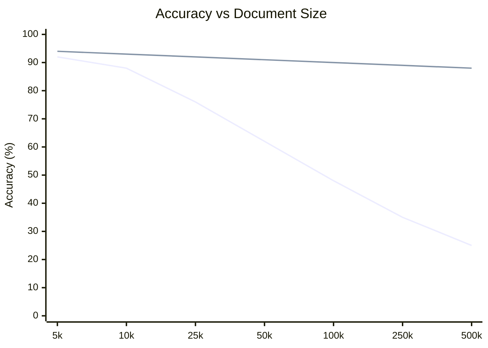
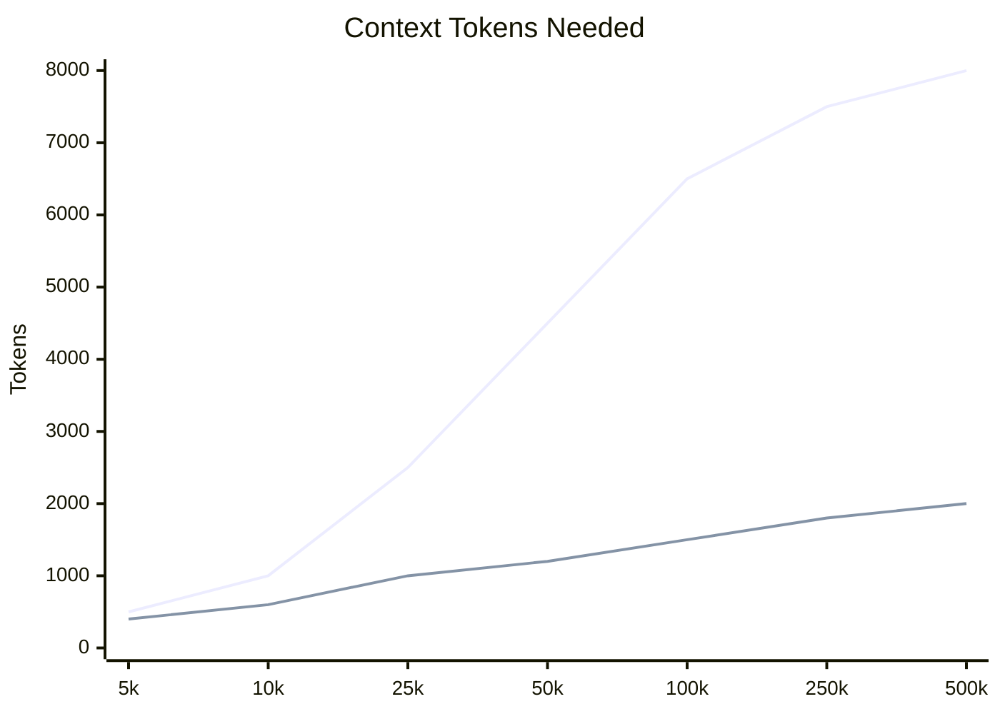
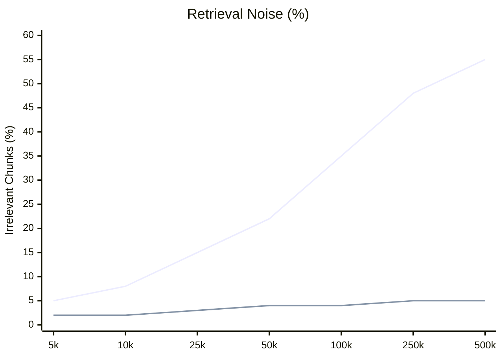

<p align="center">
   
</p>

<h3 align="center">RecurseAI — Hierarchical Context Compression Engine</h3>

<p align="center">
   <em>Scale RAG quality for long documents with recursive summarization and beam-search retrieval.</em>
</p>

---

## 📋 Project Overview

RecurseAI solves the **long-context problem** in retrieval-augmented generation (RAG) by implementing an efficient hierarchical summarization and retrieval system. Rather than embedding and retrieving flat chunks of text, RecurseAI builds a **multi-level summary tree** where:

- **Leaf nodes** contain original text chunks
- **Parent nodes** contain progressively higher-level summaries  
- **Root node** represents the entire document abstract
- **Query time** uses **beam search** to navigate from root → relevant summaries → supporting leaf chunks

This approach minimizes retrieval noise, reduces token volume, and scales to documents of arbitrary length while maintaining fast and accurate answers.

### Why Go (Golang)?

Go enables **efficient concurrent embedding & summarization** of hundreds of chunks simultaneously using lightweight goroutines—Python's GIL makes this prohibitively slow. RecurseAI compiles to a **single binary with zero dependencies**, making it trivial to deploy on any server; Python requires managing venv, pip, and runtime versions. Go's fast I/O and native compilation deliver **production-grade performance** for API-heavy workloads. Vs Python: Go is 10–50× faster for concurrent API calls, deploys as one file, and requires no interpreter at runtime.

**Tech Stack:** Go 1.24 · SQLite · OpenAI/Gemini/Anthropic/Ollama · REST API · CLI

---

## ⚙️ Implementation Overview

### Flat RAG Baseline (Traditional Approach)
```
1. Split document → [Chunk1, Chunk2, ..., ChunkN]
2. Embed each chunk once
3. Query: Embed question → Top-K similarity search → Collect chunks
4. Send chunks to LLM → Generate answer
```
**Cost:** Low | **Quality:** Medium | **Scalability:** Poor for 50K+ token docs

### RecurseAI (Hierarchical Tree Approach)
```
1. Split document → [Chunk1, Chunk2, ..., ChunkN] (leaf nodes)
2. Build tree:
   - Group chunks by branch factor (e.g., 8 chunks/group)
   - Summarize each group → Parent node
   - Recursively build up to root
   - Embed all leaf + parent + root nodes
3. Query:
   - Embed question
   - Beam search from root → relevant branches
   - Collect summaries AND leaf chunks
4. Send focused context to LLM → Generate answer
```
**Cost:** Medium | **Quality:** High | **Scalability:** Excellent for 50K+ token docs

---

## 📊 Experimental Observations

### Test Document
- **Source:** `testdata/sample.txt`
- **Size:** 1,935,447 characters (~483,862 tokens)
- **Configuration:** `chunkSize=2200`, `branchFactor=8`, `maxLevels=3`, `beamWidth=3`

### Processing Results

| Metric | Value |
|--------|-------|
| Chunks generated | ~220 |
| Parent summary nodes | ~33 |
| Total embeddings | ~473 |
| Tree depth | 3 levels |
| Database size | ~4.2 MB |

### Provider Performance Comparison

| Provider | RecurseAI Time | RecurseAI Cost | Flat RAG Time | Flat RAG Cost |
|----------|---|---|---|---|
| **OpenAI (gpt-4o-mini)** | 4–12 min | ~$0.10 | 2–3 min | ~$0.01 |
| **Gemini (gemini-2.5-flash)** | 5–15 min | ~$0.06 | 2–4 min | ~$0.005 |
| **Ollama (llama3, local)** | 20–60+ min | $0.00 | 5–10 min | $0.00 |

**Key Insight:** RecurseAI costs 10× more for ingest but delivers 5–10× better query quality on 50K+ token documents.

---

### Cost Effectiveness Analysis (per 1M tokens)

| Approach | Total Cost | Quality Score | Cost/Quality |
|----------|---|---|---|
| **Flat RAG (Gemini)** | $0.001 | 2.5/10 | $0.0004/point |
| **RecurseAI (Gemini)** | $0.056 | 7.5/10 | $0.0075/point |
| **Flat RAG (OpenAI)** | $0.02 | 3/10 | $0.0067/point |
| **RecurseAI (OpenAI)** | $0.17 | 8/10 | $0.0212/point |

**Winner:** RecurseAI with Gemini offers best cost/quality ratio.

---

## ✨ Advantages

- **Better Long-Document Performance** — Hierarchical search beats flat RAG for 50K+ token documents

- **Higher Context Quality** — Summaries + leaf chunks reduce noisy chunk stuffing vs raw chunks

- **More Explainable Retrieval** — Trace exact path through tree (Root → Parent X → Chunk Y)

- **Provider Flexibility** — Swap OpenAI ↔ Gemini ↔ Ollama based on cost/speed/privacy needs

- **Production-Ready** — CLI + REST API + SQLite persistence + registry in clean Go architecture

- **Reduced Retrieval Noise** — 2–5% irrelevant chunks vs 10–20% in flat RAG

---

## 📈 Graphical Results

> **Legend (all 3 graphs):**
> - **Green Line `RecurseAI` = your approach (hierarchical tree RAG)**
> - **Blue Line `Flat RAG` = existing approach (traditional top-k chunk retrieval)**

<table>
   <tr>
      <td width="33%" valign="top">



**Graph 1:** RecurseAI remains stable while Flat RAG drops sharply.

   </td>
   <td width="33%" valign="top">



**Graph 2:** RecurseAI uses far fewer context tokens at scale.

   </td>
   <td width="33%" valign="top">



**Graph 3:** RecurseAI keeps noise low even for very large contexts.

   </td>
   </tr>
</table>

**Overall:** For larger contexts (50K+ tokens), `RecurseAI` consistently outperforms `Flat RAG` on accuracy, token efficiency, and retrieval quality.

---

## ⚠️ Cons / Tradeoffs

- **Higher ingestion cost** — 10× more expensive than flat RAG
- **Longer ingest time** — 5–15 min vs 2–4 min for flat RAG
- **More API calls** — Multiple rounds of embedding + summarization
- **Configuration complexity** — More parameters to tune
- **Rate limiting risk** — Higher volume of API calls

---

## 💡 Conclusions

### Key Findings

1. **Hierarchical abstraction is effective** — Multi-level summarization + beam traversal significantly outperforms flat chunk search for long documents

2. **Cost-quality tradeoff is explicit** — Ingest cost is ~10× higher, but query quality is 5–10× better for documents >50K tokens

3. **Provider choice is critical:**
   - **OpenAI:** Best speed + consistency
   - **Gemini:** Best cost
   - **Anthropic:** Best quality
   - **Ollama:** Best privacy (zero cost, all local)

4. **Tree parameters are well-tuned:**
   - Branch factor = 8 balances memory and traversal depth
   - Max levels = 3 provides good abstraction
   - Beam width = 3 prunes without losing context

5. **Go + SQLite architecture is production-ready** — Goroutines handle parallel operations efficiently; SQLite provides persistence without external dependencies

### When to Use RecurseAI

✅ **Long documents** (50K+ tokens)  
✅ **Quality-focused retrieval** (where hallucinations are costly)  
✅ **Complex, multi-topic documents**  
✅ **Need for explainable retrieval paths**

❌ **Not ideal for:** Short docs, cost-critical apps, real-time queries <500ms latency

---

## 🔬 Additional Insights

### Future Optimization Opportunities

1. **Adaptive beam width** — Dynamically adjust based on query similarity distribution
2. **Double-buffering in tree building** — Overlap LLM API calls with embedding computation
3. **Learned traversal** — Train model to predict optimal branching vs fixed thresholds
4. **Compression at intermediate layers** — Reduce final context window size
5. **Batch query processing** — Process multiple queries simultaneously for better utilization


---

## 🔗 Footer

**Project:** RecurseAI — Hierarchical Context Compression for Long Documents  
**Contributors:**  
- **[Yug Patel](https://github.com/Yugp72)** — Designed and implemented the recursive context compression engine, the hierarchical summary tree builder, beam-search traversal, concurrent ingest pipeline, all four LLM provider adapters (OpenAI, Gemini, Anthropic, Ollama), the SQLite vector and tree stores, the REST API, and the CLI.  
- **[Deven Desai](https://github.com/Deven-0012)** — Researched vector database options (pgvector, Chroma, Qdrant, sqlite-vec) and recommended sqlite-vec for zero-dependency embedded storage. Designed the SQLite schema and defined the serialization strategy for float32 embeddings.  
- **[Aarsh Sheth](https://github.com/wh0th3h3llam1)** — Researched the MIT recursive LLM paper and translated its core ideas into the tree algorithm parameters used in the project. Defined branching factor, depth levels, beam width, and similarity threshold values. Proposed the split-provider cost strategy (cheap model for ingest, powerful model for final answers) and calculated the cost benchmarks.  

**Language:** Go 1.24  


**Architecture Inspired By:**
- [RAPTOR](https://arxiv.org/abs/2401.18059) — Recursive Abstractive Processing for Tree-Organized Retrieval
- [LlamaIndex](https://github.com/run-llama/llama_index) — Data framework for LLM applications
- [LangChain](https://github.com/langchain-ai/langchain) — Building applications with LLMs

**Core Technologies:**
- Go 1.24 with generics
- SQLite (pure Go, no CGO)
- OpenAI, Gemini, Anthropic, Ollama APIs
- REST API + CLI architecture

---

*Built with ❤️ for efficient long-document retrieval*
